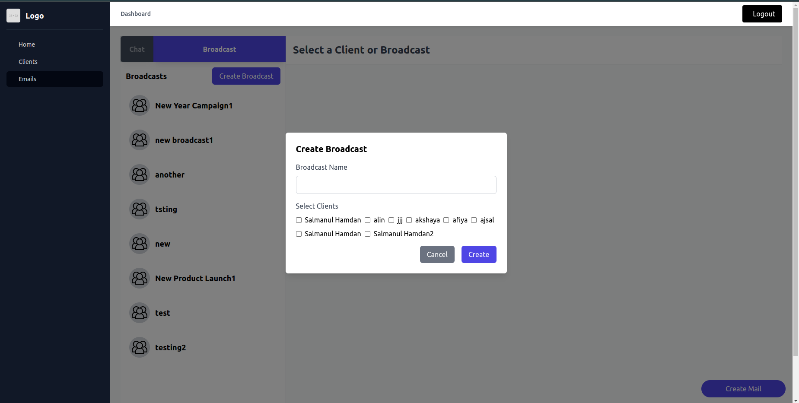

# Email Sender Application

## Description

This project is an Email Sender application designed to send emails both personally and in bulk (broadcast). The application features a backend built with Django REST Framework (DRF) and a frontend developed using React. It uses SQLite for database management and Tailwind CSS for styling.

## Features

- **Personal Email Sending:** Send emails to individual clients.
- **Broadcast Email Sending:** Send emails to multiple clients at once.
- **Client Management:** Add, edit, and delete client records.
- **Broadcast Management:** Create and manage broadcast lists.

## Technologies Used

- **Backend:** Django REST Framework (DRF)
- **Frontend:** React
- **Database:** SQLite
- **Styling:** Tailwind CSS
- **Other Tools:** Axios for HTTP requests, React Modals for user interactions

## Installation

### Backend

1. Clone the repository:

   ```bash
   git clone https://github.com/Salmanulhamdan/Codeme_project.git

2. Clone the repository:

   ```bash
   cd Codeme_project/Backend/MailSender

3. Create a virtual environment and activate it:

   ```bash
   python -m venv env
   source env/bin/activate  # On Windows, use `env\Scripts\activate`

4. Install the dependencies:
    ```bash
    pip install -r requirements.txt

5. Apply migrations:
    ```bash
    python manage.py migrate

6. Start the Django development server:
    ```bash
    python manage.py runserver


### Frontend

1. Navigate to the frontend directory:
    ```bash
    cd ../Frontend/mailsender

2. Install the dependencies:
    ```bash
    npm install

3. Start the React development server:
    ```bash
    npm start

### Screenshots





